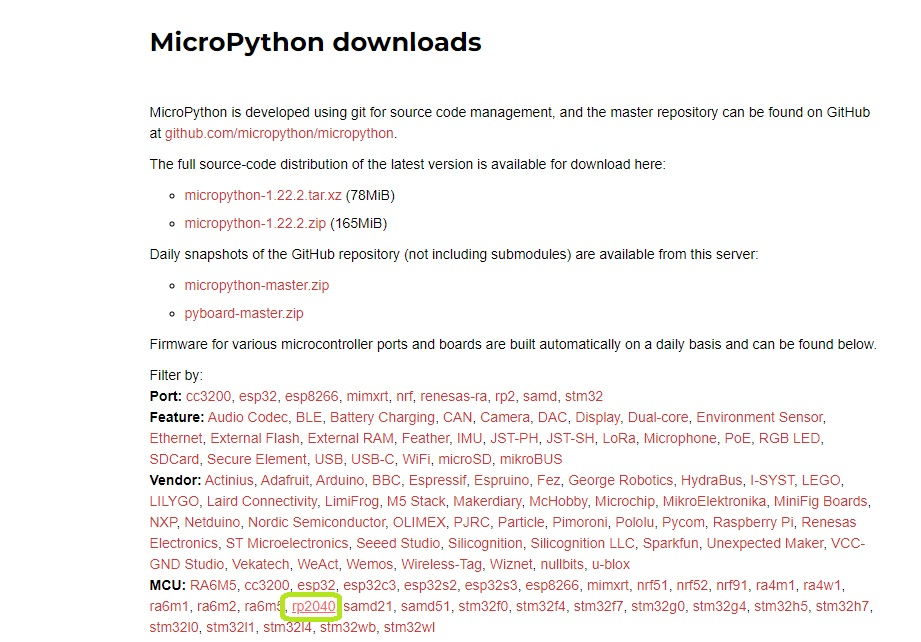
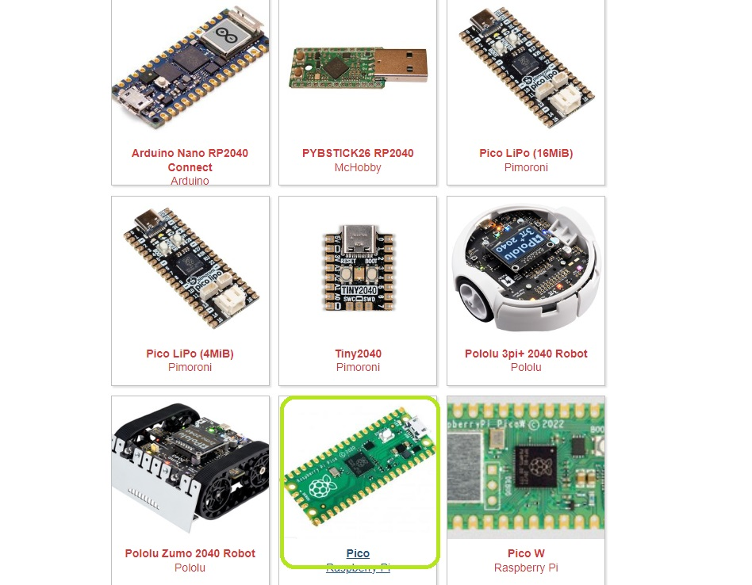
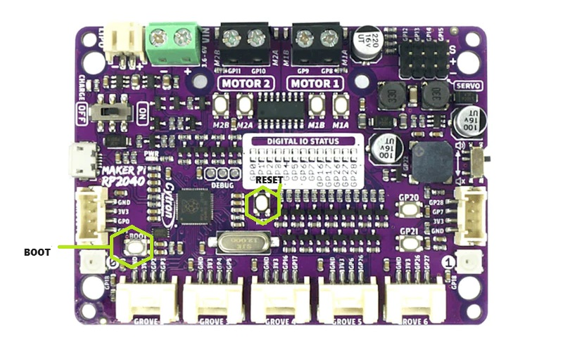

# {{ page.title }}
{: .no_toc }

## Table of Contents
{: .no_toc .text-delta }

1. TOC
{:toc}
---

## Installation of IDE 
The very first step for labs today is installation of the interactive development envirnoment you are going to use for the coding.  You can download Thonny from [here](https://thonny.org/).
<video controls width="400">
  <source src="./global_assets/thonnyinstall.webm" type="video/webm" />
</video>

## Flashing MicroPython Software
After completing the installation of the Thonny IDE, our next step is completing the installation of Micropython firmware on the MakerPi RP2040 Board. Follow the following step to accomplish this task:
1. Launch MicroPython [website](https://micropython.org/).
2. Click on [Download](https://micropython.org/download/) option from Navigation Menu.
3. The Download page shows, various different MCUs for which MicroPython is available. From MCU section click on RP2040.

4. From options select Pico Raspberry Pi. 

5. The page should now show all the releases. From Releases section, select the latest release this is indicated in bold and is the first item on the list. 
6. Click the link and it should download a UF2 file for firmware.
7. Next up, connect the board with a USB cable provided to the computer.
8. Now press both the Boot and Reset button (see Fig) on the board simultaneously. After 5 seconds or so let go of the reset button while holding boot button. After 5 seconds let go of the Boot button. 

9. You should now have a popup window showing RPI-RP2 filesystem. If this does not appear automatically then go to My Computer and you should see the board like a USB peripheral. If you are still getting the original name of the board and not RPI-RP2 or something similar then repeat the above step.
10. Now copy the UF2 file you have downloaded from MicroPython website in to this pop up window. In other words move the file to the board. 
11. Press RESET. This should have now installed MicroPython on your board.
12. Open Thonny IDE and Click on the Bottom right part which says Local Python or MicroPython or something similar. From here select the MicroPython (RP2040).

## Thony IDE Tutorial
Once you have got the MicroPython firmware on the board, you can use REPL prompt in Thonny to test Python Commands. The video below gives a quick walkthrough of basic features.

<video controls width="400">
  <source src="./global_assets/thonnyUsage.webm" type="video/webm" />
</video>

Some other places to find detailed account of IDE features include:
1. Thonny's own website and Introductory [Video](https://www.youtube.com/watch?v=nwIgxrXP-X4)
2. Random Nerd's [Page](https://randomnerdtutorials.com/getting-started-thonny-micropython-python-ide-esp32-esp8266/) which is for different processor but same steps really.
3. Raspberry Pi Pico's own [Guide](https://projects.raspberrypi.org/en/projects/getting-started-with-the-pico/2).
4. Micropython [Book](./global_assets/book.pdf) from Raspberry Pi Foundation.

## Board Details and Relevant Documents
All relevant documents are on these two pages:
1. Github [Page](https://github.com/CytronTechnologies/MAKER-PI-RP2040?tab=readme-ov-file) for the Board
2. Product [Page](https://www.cytron.io/p-maker-pi-rp2040-simplifying-robotics-with-raspberry-pi-rp2040) by Cytron.