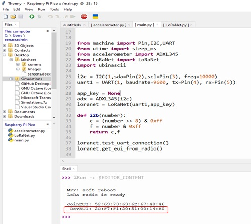
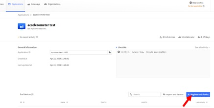
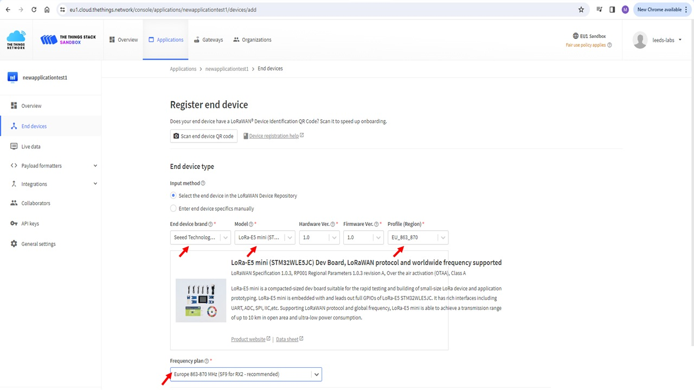
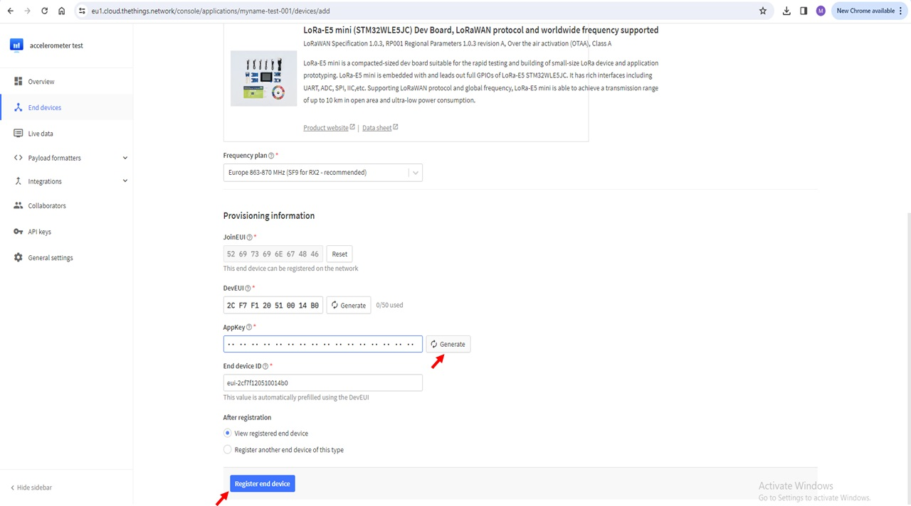
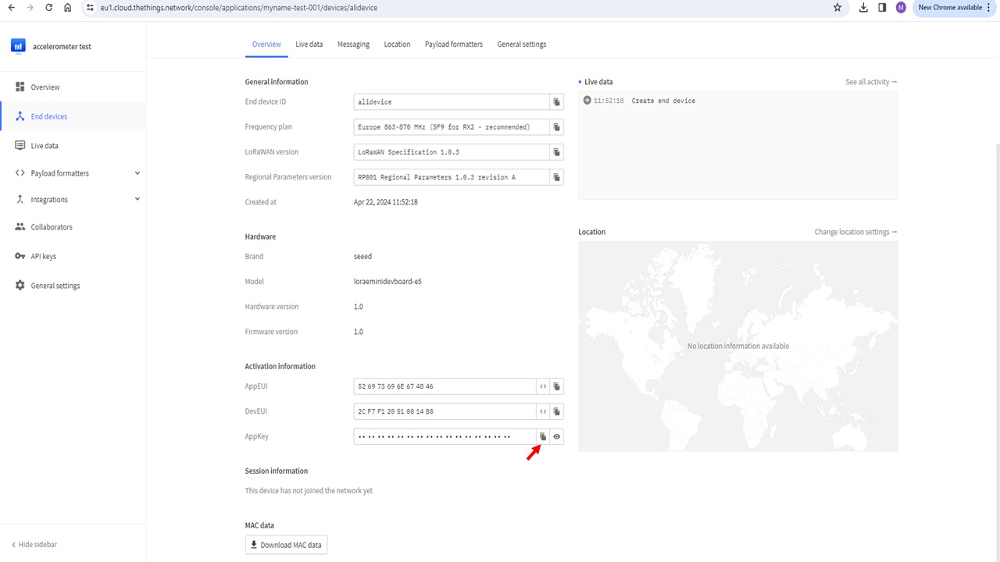
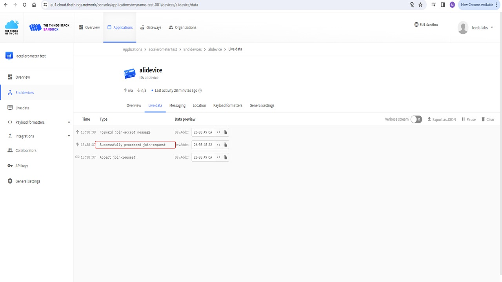
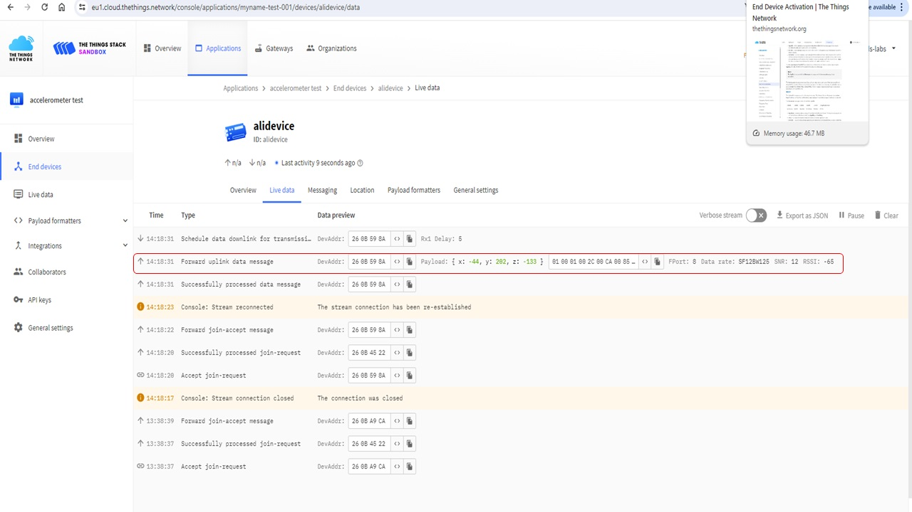
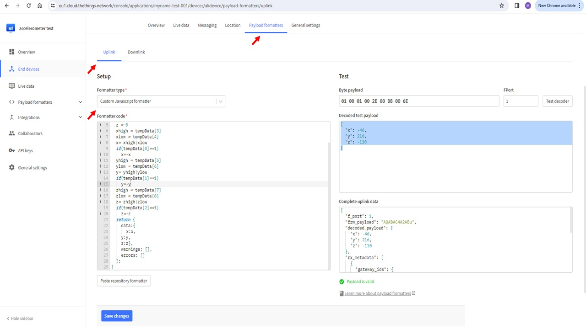

# {{ page.title }}
{: .no_toc }

## Table of Contents
{: .no_toc .text-delta }

1. TOC
{:toc}
---

# LoRa and LoRaWAN
LoRa (Long Range) is radio frequency (RF) modulation technology that is suited for low power communication in Wide Area Networks (WANs). It operates in the license free Industrial, Scientific and Medical (ISM) frequency bands, for example, 915 MHz, 868 MHz, and 433 MHz. Typical coverage area for LoRa based communication is up to 3 miles in urban areas and 10 miles in rural areas. Due to its wide range and low power requirements, it is particularly well-suited for internet of things (IoT) communication where large number of low power devices send/receive small amounts of data forming a low power wide area network (LPWAN). LoRa is ideal for data transmission at a longer range compared to technologies like WiFi, Bluetooth or ZigBee making it a popular choice for sensors and actuators that operate in low power mode. 

LoRA Wide Area Network (LoRaWAN) is a Media Access Control (MAC) layer protocol built on top of LoRa modulation. It is a software layer which defines how devices use the LoRa hardware, for example when they transmit, and the format of messages. A LoRa network consists of nodes, gateways and LoRa network operators. Typically, nodes broadcast data to be picked up by gateways that forward the information to operator servers for processing.A LoRa transmitter broadcasts messages to gateways that forward the messages the LoRaWAN network server/cloud for processing. More details on LoRaWAN, its parameters and working is left for self study. An excellent resource can be found here: [LoRa Book][def]

{: .note }
In this lab, you will learn some basics about the tecnhology along as well as send your accelerometer data (x,y,z) from previous lab using Seeed LoRa-E5 module interfaced with the MakerPi RP2040 board we have been using. Seeed LoRa-E5 is a compacted-sized development board suitable for the rapid testing and building of small-size prototyping and helps you design your ideal LoRaWAN wireless IoT device with a long-distance transmission range. The data will be broadcasted and will be picked up by one of The Things Network (TTN) gateways deployed across Leeds. You will be using Thonny IDE for coding as before. To setup, please follow instructions from previous lab.


# The Things Network (TTN)
The Things Network provides a global, open LoRaWAN network with a set of open tools and to build an IoT application at low cost. We will be using TTN gateway for receiving our accelerometer data from a LoRa IoT node.

## Creating a new IoT application
To begin, navigate to [The Things Network Homepage](https://www.thethingsnetwork.org/). You will see the following page:


.jpg)


Click login as shown and choose **Experiment and explore with The Things Network** option. 

.jpg) 


On the next page, use login detals as follows:

Email: leeds_labs

Password: lora1406@

Then click **Login with The Things ID**. After loggin in, click on console from the user drop down menu on the right as shown .jpg). To configure regional settings, use United Kingdom from the **Device or gateway lcation** dropdown and select **Europe 1** from existing clusters. .jpg. Choose **Create Application** on the next page. 


.jpg)


Enter a unique Application ID on the following screen along with an **Accelerometer Test** as application name and description in respective text boxes as shown. Click create application button. Try out a few if the one you entered already exists untill you have a unique ID to create an application. Once you have successfully created an application, it will appear in the list of existing applications and can be accessed from the **Applications** tab on the top of the TTN webpage.  

## Registering a new device
To register an IoT end node, we need to specify it Device and Join Extended Uniques Identifies abbreviated as DevEUI and JoinEUI respectively. The DevEUI is  64-bit globally-unique ID assigned by the manufacturer, or the owner, of the end-device. The JoinEUI (AppEUI) is a 64-bit globally unique identifier assigned to the LoRaWAN network's Join Server by either its owner or operator. We first need to extract this from our LoRa board which is connected to the RP2040. For this purpose, complete the following steps:
1. Plug in the RP2040 to the lab computer. 
2. Create a new folder called Lab 3.
3. Navigate to this folder from Thonny IDE.
4. Create two new files in this folder, one called **main.py** and other called **LoRaNet.py**.
5. In **LoRaNet.py** file copy the code which is provide below.

```python
from utime import sleep_ms
from sys import exit

class LoRaNet:
    def __init__(self,uart,appKey):
        self.uart = uart
        self.appKey = appKey
        self.band ='EU868'
        self.channels='0-2'
        self.join_EUI = None   # These are populated by this script
        self.device_EUI = None
        self.rxData = None
        self.data=None
        self.done=False
        self.status = 'not connected'
    
    def receive_uart(self):
        '''Polls the uart until all data is dequeued'''
        self.rxData=bytes()
        while self.uart.any()>0:
            self.rxData += self.uart.read(1)
            sleep_ms(2)
        return self.rxData.decode('utf-8')
    
    def send_AT(self,command):
        '''Wraps the "command" string with AT+ and \r\n'''
        buffer = 'AT' + command + '\r\n'
        self.uart.write(buffer)
        sleep_ms(300)
    
    def test_uart_connection(self):
        '''Checks for good UART connection by querying the LoRa-E5 module with a test command'''
        self.send_AT('') # empty at command will query status
        self.data = self.receive_uart()
        if self.data == '+AT: OK\r\n' : print('LoRa radio is ready\n')
        else:
            print('LoRa-E5 detected\n')
            exit()
        
    def get_eui_from_radio(self):
        '''Reads both the DeviceEUI and JoinEUI from the device'''
        self.send_AT('+ID=DevEui')
        self.data = self.receive_uart()
        self.device_EUI = self.data.split()[2]
        self.send_AT('+ID=AppEui')
        self.data = self.receive_uart()
        self.join_EUI = self.data.split()[2]
        print(f'JoinEUI: {self.join_EUI}\n DevEUI: {self.device_EUI}')
        
    def set_app_key(self,appKey):
            if self.appKey is None:
                print('\nGenerate an AppKey on cloud.thethings.network and enter it at the top of this script to proceed')
                exit()
            self.send_AT('+KEY=APPKEY,"' + self.appKey + '"')
            self.receive_uart()
            print(f' AppKey: {self.appKey}\n')
    
    
    def configure_regional_settings(self, DR='0'):
        ''' Configure band and channel settings'''
    
        self.send_AT('+DR=' + self.band)
        self.send_AT('+DR=' + DR)
        self.send_AT('+CH=NUM,' + self.channels)
        self.send_AT('+MODE=LWOTAA')
        self.receive_uart() # flush
    
        self.send_AT('+DR')
        self.data = self.receive_uart()
        print(self.data)
    
    
    def join_the_things_network(self):
        '''Connect to The Things Network. Exit on failure'''
        self.send_AT('+JOIN')
        self.data = self.receive_uart()
    
        print(self.data)

        self.status = 'not connected'
        while self.status == 'not connected':
            self.data = self.receive_uart()
            if len(self.data) > 0: print(self.data)
            if 'joined' in self.data.split():
                self.status = 'connected'
            if 'failed' in self.data.split():
                print('Join Failed')
                exit()
        
            sleep_ms(1000)
            
    def send_message(self,message):
        '''Send a string message'''
        self.send_AT('+MSG="' + message + '"')

        self.done = False
        while not self.done:
            self.data = self.receive_uart()
            if 'Done' in self.data or 'ERROR' in self.data:
                self.done = True
            if len(self.data) > 0: print(self.data)
            sleep_ms(1000)
            
    def send_hex(self,message):
        self.send_AT('+MSGHEX="' + message + '"')
        self.done = False
        while not self.done:
            self.data = self.receive_uart()
            if 'Done' in self.data or 'ERROR' in self.data:
                self.done = True
            if len(self.data) > 0: print(self.data)
            sleep_ms(1000)
```

In **main.py** copy the following code:

```python
from machine import Pin,I2C,UART
from utime import sleep_ms
from accelerometer import ADXL345
from LoRaNet import LoRaNet
import ubinascii

i2c = I2C(1,sda=Pin(2),scl=Pin(3), freq=10000)
uart1 = UART(1, baudrate=9600, tx=Pin(4), rx=Pin(5))
app_key = None 
adx = ADXL345(i2c)
loranet = LoRaNet(uart1,app_key)

def i2b(number):
    c = (number >> 8) & 0xff
    f = number & 0xff
    return c,f

loranet.test_uart_connection()
loranet.get_eui_from_radio()

```
Run the code to get the following output which provides you DevEUI and JoinEUI. Copy this from the Thonny output as shown below.





It is now time to configure the application and associate an end IoT node with it. For this, click on the **Register End Device** button at the bottom right corner of your newly created application's page as shown in the screenshot below.


 


 You will be taken to the device specification page. Here, fill in the following information:
 1. Choose **Select the end device in the LoRaWAN Device Repository** in the inpt method for end device type section.
 2. From the dropdown menu, select **Seeed Technology Co. Limited** as End Device Brand, **LoRa-E5 mini** as the Model and **EU_863_870** in the Profile (Region) dropdown. Leave Hardware and Firmaware version as 1.0 as set by default. Do not change this.
 3. Select frquency plan to be **Europe 863-870 MHz (SF9 for RX-recommended)**.

 
 
 4. In the Provisioning Information section, provide the **JoinEUI** from Thonny IDE output. Click **Confirm**.
 5. Similarly provide the **DevEUI**.
 6. Click **Generate** to populate the AppKey field. The AppKey is an AES-128 bit secret key known as the root key. The same AppKey should be provisioned onto the device which is registering with the TTN appliaction (we will do this later).
 7. Finish by clicking **Register end device** button at the bottom of the page.


 


<details>
<summary>Task 1</summary>
Device Registration is now complete. Locate this deivce in your newly created application information. In **Overview** of the device, find  **AppKey** field and copy its contents to the clipboard. 
</details>

## Joining TTN
To join TTN, the end node needs to be provisioned with the same application key (AppKey) as associated with the device in the TTN application we created and copied to clipboard in task 1 above. See screeshot below if you have not been able to find it.





 To add this to the LoRa node, find the statement appKey='NONE' in main.py and replace 'NONE' with the copied appKey by pasting it as follows. 

``` python
# Put your key here (string). This should match the AppKey generated by your application.
#For example: app_key = 'E08B834FB0866939FC94CDCC15D0A0BE'
app_key = "9EED71EE577D49D45CB2FDB19242F302"  #donot forget to add quotation marks after pasting appKey here
```
For the board to join the network, add the following commands to the end the exisitng code in main.py:

```python

loranet.set_app_key(app_key)
loranet.configure_regional_settings()
loranet.join_the_things_network()

```

Now observe the live data received at the TTN gateway by navigating to **Live Data** tab of the device. Observe the messages on TTN. You should see te following joining confirmation:





# Sending Accelerometer data over LoRa to TTN
As stated in the beginning, our objective of today's lab is to send the accelerometer data we captured in last lab to TTN using LoRa communication. A tidy solution to previous lab that returns accelerometer data is below. Feel free to use your own code that returns x, y and z values in hexadecimal form or copy the code below to the main.py that we are developing in this lab.

```python
def getFmtData():
    x=adx.xValue
    y=adx.yValue
    z=adx.zValue
    print('The acceleration info of x, y, z are:%d,%d,%d'%(x,y,z))
    data_sent = [0,0,0,0,0,0,0,0,0]
    if(x<0):
        data_sent[0]=1
    if(y<0):
        data_sent[1]=1
    if(z<0):
        data_sent[2]=1
    x=abs(x)
    y=abs(y)
    z=abs(z)
    c,f=i2b(x)
    data_sent[3] = c
    data_sent[4] = f
    c,f=i2b(y)
    data_sent[5] = c
    data_sent[6] = f
    c,f=i2b(z)
    data_sent[7] = c
    data_sent[8] = f
    return bytes(data_sent).hex(),x,y,z
```
Now that we have x, y, and z value sfrom the accelerometer, all we need to do is transmit this using LoRa E5 chip to TTN. Having completed the registeration and joining procedure, our chip is ready to send the data. Add the following code to main.py, run the code and observe the live data at TTN webpage. Wait for a minute for the data to be received.

```python

timeConstant=60000 #minute in ms

while True:
    hex_data,x,y,z=getFmtData()
    print(hex_data)
    loranet.send_hex(hex_data)
    sleep_ms(timeConstant*1) #sends every 1 minute


```
At TTN, you will see a similar payload as in the screenshot below. You can copy the payload by using the copy option next to it.





{: .note }
On The Things Network's a Fair Use Policy applies which limits the uplink airtime to 30 seconds per day (24 hours) per node and the downlink messages to 10 messages per day (24 hours) per node. Note that in the latest code, the function sleep_ms() restricting the transmission of data to once every minute. However, if the code continues to run for a while, you will soon exhaust the fair use policy allowance and will not be allowed to transmit for the next 24 hours. It is important to keep this in mind and stop the code from running while you are coding and leaving the desk. You also need to set a sensible transmission schedule by changing the multiplier in the argument of the sleep_ms() function. For example, if you change it to timeConstant*5, it will transmit once every 5 minutes. 


<details>
<summary>Task 2</summary>
Add new functionality which reads changes in x, y, and z data from the accelerometer and transmits data only when there is a siginifcant change in data.
</details>

# Decoding the Payload
To decode the accelerometer data correctly, we will use **Payload Formatters** tab in TTN. Within the tab, select **Uplink** and **Formatter Type** to be **Custom Javascript Formatter**. In the formatter code section, paste the following code:


```js
function decodeUplink(input) {
  tempData = input.bytes
  x = 0
  y = 0
  z = 0
  xhigh = tempData[3]
  xlow = tempData[4]
  x= xhigh|xlow
  if(tempData[0]==1)
    x=-x
  yhigh = tempData[5]
  ylow = tempData[6]
  y= yhigh|ylow
  if(tempData[1]==1)
    y=-y
  zhigh = tempData[7]
  zlow = tempData[8]
  z= zhigh|zlow
  if(tempData[2]==1)
    z=-z
  return {
    data:{
      x:x,
    y:y,
    z:z},
    warnings: [],
    errors: []
  };
}
```
You can test the received payload using the Test panel on the right. Paste the contents of the payload in the **Byte Payload** text box and press the **Test Decoder** button. It will show the readings of the accelerometer which can be cross checked with output Thonny output when data was successfully sent. The two payloads will match.





[def]: ../global_assets/lorabook.pdf