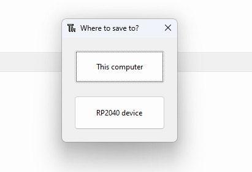

# {{ page.title }}
{: .no_toc }

## Table of Contents
{: .no_toc .text-delta }

1. TOC
{:toc}
---

## Blinking LED
Blinking an LED is the equivalent of "hello world" program for embedded developers. The main **learning objective** of this exercise is to familiarise you with input/output on embedded boards using MicroPython.

{: .note }
I am fully aware of how dull my students find blinking bunch of LEDs. Bear with me for this lab and we will not only learn the syntax but also see what is possible by merely blinking LEDs.

The board we are using for our labs has plenty of LEDs for us to play with. Several general purpose input and output pins (GPIOs) e.g. GPIO0, GPIO1, GPIO2, GPIO3 etc. connected to blue LEDs. These LEDs are mainly for debugging purpose to show the status of GPIO.  In order, to blink any of these LEDs, you just need to set the corresponding IO Pin to high or value 1. Let us try, following piece of code:
```python
#import the module necessary to interact with GPIO
import machine

#declaration of Pin 1 as Output Pin
myPin = machine.Pin(1, machine.Pin.OUT) 

#set Pin to be high
myPin.value(1)
```

Once, you have written this code in Thonny IDE, save it as main.py on the **RP2040** device. When you try and save your script, the IDE should ask you where you want it saved using the popup as shown below. Use RP2040 as the option.

 {style="display: block; margin: 0 auto"}

 In MicroPython, the machine module provides functions to interact with the hardware directly. Several functions provide access to hardware peripherals, e.g. timers, CPU clock, buses etc. Use this module incorrectly and it unleashes the wrath upon your hardware.  Here is the link to the documentation for the details.

 <span class="fs-8">
[Link button](https://docs.micropython.org/en/latest/library/machine.html){: .btn .btn-purple }
</span>
